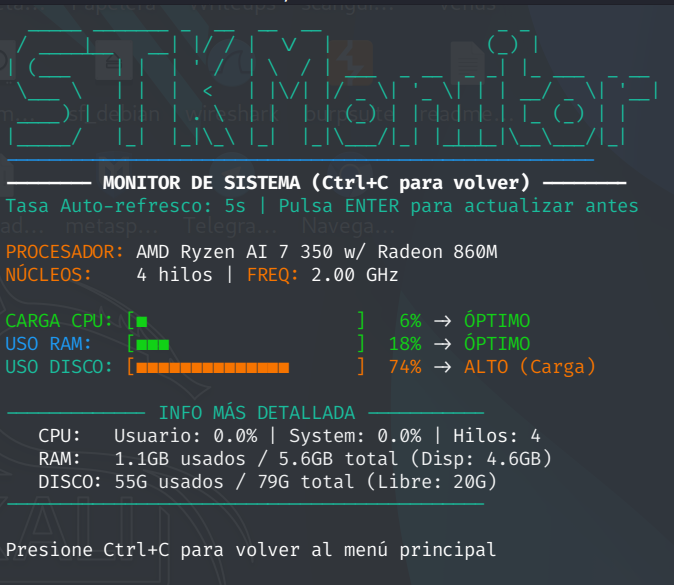

# 🛠️ STK - System Tool Kit (v5.7)

**System Tool Kit** es una potente herramienta de mantenimiento para sistemas basados en Linux (probada en Debian/Ubuntu/Kali/Fedora y las mismas distros en WSL2). Proporciona una interfaz visual intuitiva gracias a los menús creados con FZF para gestionar el mantenimiento/actualización, monitorización y administración del sistema.





## ✨ Funciones Principales
* **🚀 Actualización:** Repositorios y paquetes al día con un solo comando.
* **🧹 Súper Limpieza:** Borrado de caché, paquetes huérfanos y basura del sistema.
* **📊 Monitor Real-time:** Seguimiento visual de CPU, RAM, Temperatura y Disco.
* **👥 Usuarios:** Interfaz para crear, listar y eliminar usuarios fácilmente.
* **💾 Backup:** Copias de seguridad automáticas de tus documentos en .zip.

## 🚀 Cómo empezar

1. **Clona el proyecto:**
   ```bash
   git clone [https://github.com/DanSanMar/System-Tool-Kit.git](https://github.com/DanSanMar/System-Tool-Kit.git)
   cd System-Tool-Kit
